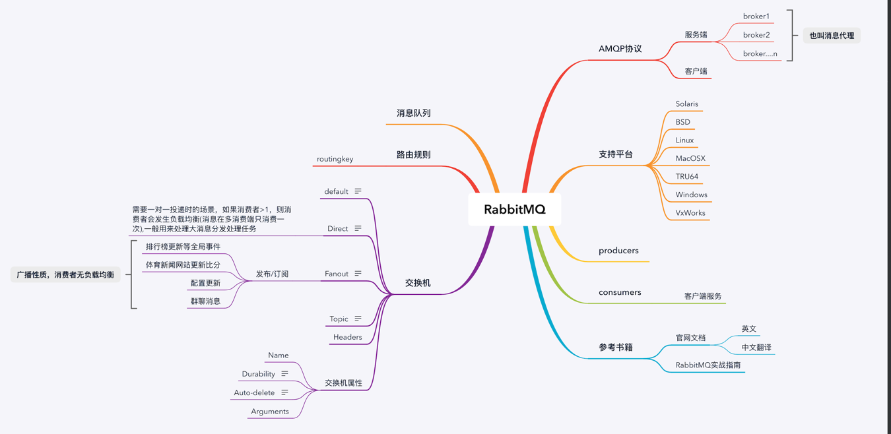
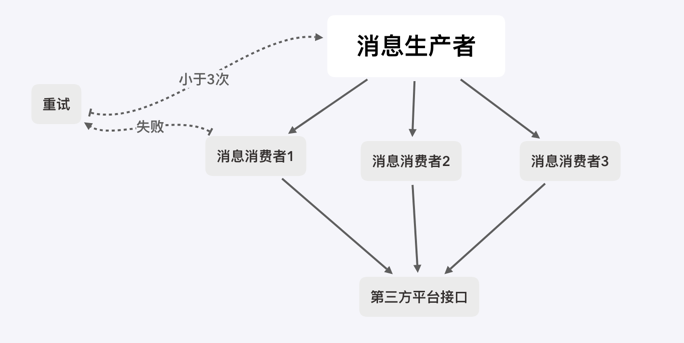
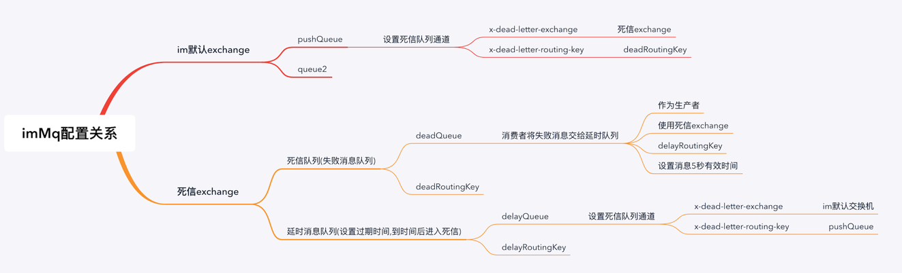
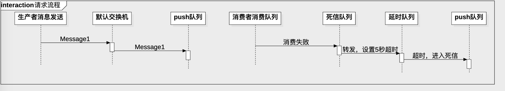

# spring-boot-rabbitMQ

官网：https://www.rabbitmq.com

rabbitmq中文文档：
    
    https://rabbitmq.mr-ping.com/

1. 安装

由于我是迫切想用它，所以用docker直接省了安装这一步。

用的最新的官方镜像：
    
    bitnami/rabbitmq:latest
    

rabbitMQ版本：
        
        3.8.2

启动成功后，正常情况下会有四个端口号：

* 4369 (epmd) 
* 25672 (Erlang distribution)
* 5672, 5671 (启用了 或者 未启用 TLS 的 AMQP 0-9-1)
* 15672 (如果管理插件被启用)

安装完成后，访问：

http://127.0.0.1:15672

2. 新增用户

官网资料上说rabbitMQ有一个默认的guest/guest账号，但是我拉的这个镜像里是没有的。

我们看一下有没有用户：

进入docker:
        
        docker exec -it rabbitmq bash
        
        
查看是否有用户：

        rabbitmqctl  list_users
        
返回：
        
        
好像看到有个tags和administor 用户，但其实不是用户列表。
        
        
新增一个用户：
        
        rabbitmqctl add_user sam 123456
        
将这个用户提为管理员：
        
        set_user_tags sam administrator

        

3. 集成springboot

pom.xml:

    <?xml version="1.0" encoding="UTF-8"?>
    <project xmlns="http://maven.apache.org/POM/4.0.0" xmlns:xsi="http://www.w3.org/2001/XMLSchema-instance"
        xsi:schemaLocation="http://maven.apache.org/POM/4.0.0 http://maven.apache.org/xsd/maven-4.0.0.xsd">
        <modelVersion>4.0.0</modelVersion>
    
        <groupId>com.example</groupId>
        <artifactId>rabbitMQ</artifactId>
        <version>0.0.1-SNAPSHOT</version>
        <packaging>war</packaging>
    
        <name>rabbitMQ</name>
        <description>Demo project for Spring Boot</description>
    
        <parent>
            <groupId>org.springframework.boot</groupId>
            <artifactId>spring-boot-starter-parent</artifactId>
            <version>2.1.9.RELEASE</version>
            <relativePath/> <!-- lookup parent from repository -->
        </parent>
    
        <properties>
            <project.build.sourceEncoding>UTF-8</project.build.sourceEncoding>
            <project.reporting.outputEncoding>UTF-8</project.reporting.outputEncoding>
            <java.version>1.8</java.version>
        </properties>
    
        <dependencies>
            <dependency>
                <groupId>org.springframework.boot</groupId>
                <artifactId>spring-boot-starter-web</artifactId>
            </dependency>
    
            <dependency>
                <groupId>org.mybatis.spring.boot</groupId>
                <artifactId>mybatis-spring-boot-starter</artifactId>
                <version>1.3.0</version>
            </dependency>
    
    
            <!--<dependency>-->
                <!--<groupId>org.apache.rabbitMQ</groupId>-->
                <!--<artifactId>rabbitMQ-pool</artifactId>-->
                 <!--<version>5.14.3</version>-->
            <!--</dependency>-->
    
            <dependency>
                <groupId>org.springframework.boot</groupId>
                <artifactId>spring-boot-starter-amqp</artifactId>
            </dependency>
    
            <dependency>
                <groupId>org.projectlombok</groupId>
                <artifactId>lombok</artifactId>
                <optional>true</optional>
            </dependency>
    
            <dependency>
                <groupId>org.springframework.boot</groupId>
                <artifactId>spring-boot-starter-test</artifactId>
                <scope>test</scope>
            </dependency>
    
    
        </dependencies>
    
        <build>
            <plugins>
                <plugin>
                    <groupId>org.springframework.boot</groupId>
                    <artifactId>spring-boot-maven-plugin</artifactId>
                </plugin>
            </plugins>
        </build>
    
        <repositories>
            <repository>
                <id>alimaven</id>
                <url>http://maven.aliyun.com/nexus/content/groups/public/</url>
            </repository>
            <repository>
                <id>spring-snapshots</id>
                <url>http://repo.spring.io/snapshot</url>
                <snapshots><enabled>true</enabled></snapshots>
            </repository>
            <repository>
                <id>spring-milestones</id>
                <url>http://repo.spring.io/milestone</url>
            </repository>
        </repositories>
    
    </project>

4. rabbitMQ知识地图

[下载地图](.README_images/RabbitMQ.xmind)

5. 什么是死信队列

死信队列: DLX，dead-letter-exchange
其实就是在一般的队列上面设置dlx属性。
利用 dlx，当消息在一个队列中变成死信 (dead message) 之后，它能被重新 publish 到另一个 exchange，这个 exchange 就是 dlx

6. 什么情况会变成死信队列

消息变成死信的原因有:
    
    1.消息被拒绝 (basic.reject / basic.nack) 并且 reQueue=false

    2.消息 TTL 过期

    3.队列达到最大长度了

7. 实现死信的两种方式

* 设置原生队列dlx参数

* 安装rabbitMQ官方提供的插件

7. 写一个死信队列的场景，来实现请求第三方平台接口失败时，延时重试
厂里需要能够支持10万+的请求，要求有重试机制，时间两天，请记住2020年6月25号，这个端午假期，说是有三倍工资，拭目以待。

基本已经定了使用rabbitMQ实现负载分发，但是我们需要调用第三方平台的接口，而第三分平台接口貌似只支持每秒钟100次调用，超过这个频率了就会失败，或者报错。
要求：
    1. 消费者在调用第三方平台接口如果报错或者失败的情况下，要将失败的消息存起来，5秒后重试，同一消息重试不能超过3次。
    2. 多消费者不能重复消费
    
以下是基本的流程：
    
    
    

8. MQ的交换机与队列配置如下：

9. IM在MQ的这个配置中的请求流程

[参考文章](https://www.cnblogs.com/mfrank/p/11184929.html)

10. 代码实现

RabbitMQConfig.java:

        package com.example.demo.config;
        
        import org.springframework.amqp.core.*;
        import org.springframework.amqp.rabbit.AsyncRabbitTemplate;
        import org.springframework.amqp.rabbit.connection.CachingConnectionFactory;
        import org.springframework.amqp.rabbit.connection.ConnectionFactory;
        import org.springframework.amqp.rabbit.core.RabbitTemplate;
        import org.springframework.amqp.rabbit.listener.SimpleMessageListenerContainer;
        import org.springframework.beans.factory.annotation.Qualifier;
        import org.springframework.context.annotation.Bean;
        import org.springframework.context.annotation.Configuration;
        
        import java.util.HashMap;
        import java.util.Map;
        
        @Configuration
        public class RabbitMQConfig {
        
            public static final String IM_DEFAULT_EXCHANGE_NAME = "test.im.exchange.push";
            public static final String IM_PUSH_QUEUE_NAME = "test.im.queue.push";
            public static final String IM_PUSH_ROUTING_KEY = "test.im.routingkey.push.*";
            public static final String IM_DEAD_LETTER_QUEUE_NAME = "test.im.queue.deadLetterPush";
            public static final String IM_DEAD_LETTER_PUSH_EXCHANGE = "test.im.exchange.deadLetterPush";
            private static final String IM_DEAD_LETTER_ROUTING_KEY = "test.im.routingkey.deadLetterPush";
            private static final String IM_DELAY_QUEUE_NAME = "test.im.queue.delayPush";
            public static final String IM_DELAY_ROUTING_KEY = "test.im.routingkey.delayPush";
            private static final String IM_DELAY_PUSH_ROUTING_KEY = "test.im.routingkey.push.delay";
            public static final String REPLY_QUEUE_NAME = "test.im.queue.reply";
            public static final String REPLY_ROUTING_KEY = "test.im.routingkey.reply";
            public static final String REPLY_EXCHANGE_NAME = "test.im.exchange.reply";
        
        
        
            @Bean
            AsyncRabbitTemplate asyncRabbitTemplate(RabbitTemplate rabbitTemplate, ConnectionFactory connectionFactory) {
        
                SimpleMessageListenerContainer container = new SimpleMessageListenerContainer(connectionFactory);
                container.setQueueNames(REPLY_QUEUE_NAME);
        //        rabbitTemplate.setRoutingKey(REPLY_ROUTING_KEY);
        //        rabbitTemplate.setExchange(REPLY_EXCHANGE_NAME);
        //        rabbitTemplate.setReplyAddress(REPLY_ROUTING_KEY);
                AsyncRabbitTemplate template = new AsyncRabbitTemplate(rabbitTemplate,container);
                template.setReceiveTimeout(5000);
        
                return template;
            }
        
            @Bean("replyExchange")
            public DirectExchange replyExchange(){
                return new DirectExchange(REPLY_EXCHANGE_NAME);
            }
        
            @Bean("replyRabbitQueue")
            public Queue replyRabbitQueue(){
                return new Queue(REPLY_QUEUE_NAME);
            }
        
            @Bean
            public Binding replyRabbitBinding(@Qualifier("replyRabbitQueue") Queue queue,
                                             @Qualifier("replyExchange") DirectExchange exchange){
                return BindingBuilder.bind(queue).to(exchange).with(REPLY_ROUTING_KEY);
            }
        
        
            // 声明死信Exchange
            @Bean("imDeadLetterPushExchange")
            public DirectExchange imDeadLetterPushExchange(){
                return new DirectExchange(IM_DEAD_LETTER_PUSH_EXCHANGE);
            }
        
            // 声明imPush死信队列
            @Bean("imDeadLetterQueue")
            public Queue imDeadLetterQueue(){
                Map<String, Object> args = new HashMap<>(2);
                args.put("x-max-length", 60000);
                return QueueBuilder.durable(IM_DEAD_LETTER_QUEUE_NAME).withArguments(args).build();
            }
        
        
            // 声明IMExchange
            @Bean("imPushExchange")
            public TopicExchange imPushExchange(){
                return new TopicExchange(IM_DEFAULT_EXCHANGE_NAME);
            }
        
            // 声明imPush队列
            @Bean("imPushQueue")
            public Queue imPushQueue(){
                Map<String, Object> args = new HashMap<>(2);
        //       x-dead-letter-exchange    这里声明当前队列绑定的死信交换机
                args.put("x-dead-letter-exchange", IM_DEAD_LETTER_PUSH_EXCHANGE);
        //       x-dead-letter-routing-key  这里声明当前队列的死信路由key
                args.put("x-dead-letter-routing-key", IM_DEAD_LETTER_ROUTING_KEY);
        
                args.put("x-max-length", 100000);
                return QueueBuilder.durable(IM_PUSH_QUEUE_NAME).withArguments(args).build();
            }
        
        
            // 声明push业务队列绑定关系
            @Bean
            public Binding imPushBinding(@Qualifier("imPushQueue") Queue queue,
                                            @Qualifier("imPushExchange") TopicExchange exchange){
                return BindingBuilder.bind(queue).to(exchange).with(IM_PUSH_ROUTING_KEY);
            }
        
            // 声明push死信队列绑定关系
            @Bean
            public Binding deadLetterBinding(@Qualifier("imDeadLetterQueue") Queue queue,
                                            @Qualifier("imDeadLetterPushExchange") DirectExchange exchange){
                return BindingBuilder.bind(queue).to(exchange).with(IM_DEAD_LETTER_ROUTING_KEY);
            }
        
        
        
            /**
             * 如果delayQueue中的消息超时，则重新会到业务队列中
             * @return
             */
            @Bean("imDelayQueue")
            public Queue imDelayQueue(){
                Map<String, Object> args = new HashMap<>(2);
        //       x-dead-letter-exchange    这里声明当前队列绑定到业务交换机
                args.put("x-dead-letter-exchange", IM_DEFAULT_EXCHANGE_NAME);
        //       x-dead-letter-routing-key  这里声明当前队列的死信路由key:使用业务队列
                args.put("x-dead-letter-routing-key", IM_DELAY_PUSH_ROUTING_KEY);
                args.put("durable", true);
                args.put("x-message-ttl", 3000);
                args.put("x-max-length", 50000);
                return QueueBuilder.durable(IM_DELAY_QUEUE_NAME).withArguments(args).build();
            }
        
            @Bean
            public Binding imDelayQueueBinding(@Qualifier("imDelayQueue") Queue queue,
                                               @Qualifier("imDeadLetterPushExchange") DirectExchange exchange){
                //使用死信队列的交换机机，和死信队列共用一个交换机机
                return BindingBuilder.bind(queue).to(exchange).with(IM_DELAY_ROUTING_KEY);
            }
        
        }

* 生产者实现
 
 BusinessMessageSender.java:
 
         package com.example.demo.service;
         
         import com.alibaba.fastjson.JSON;
         import com.example.demo.bean.IMMQMessage;
         import lombok.extern.slf4j.Slf4j;
         import org.springframework.amqp.AmqpException;
         import org.springframework.amqp.core.Address;
         import org.springframework.amqp.core.Message;
         import org.springframework.amqp.core.MessagePostProcessor;
         import org.springframework.amqp.rabbit.AsyncRabbitTemplate;
         import org.springframework.amqp.rabbit.connection.CorrelationData;
         import org.springframework.amqp.rabbit.core.RabbitTemplate;
         import org.springframework.beans.factory.annotation.Autowired;
         import org.springframework.context.annotation.Bean;
         import org.springframework.stereotype.Component;
         import org.springframework.util.concurrent.ListenableFutureCallback;
         
         import javax.annotation.PostConstruct;
         
         import java.io.UnsupportedEncodingException;
         import java.util.UUID;
         
         import static com.example.demo.config.RabbitMQConfig.*;
         
         @Slf4j
         @Component
         public class BusinessMessageSender {
         
             @Autowired
             private RabbitTemplate rabbitTemplate;
         
             @Autowired
             private AsyncRabbitTemplate asyncRabbitTemplate;
         
         
             @PostConstruct
             public void init() {
                 rabbitTemplate.setConfirmCallback((correlationData, ack, error) -> {
                     log.info("消息唯一标识：" + correlationData);
                     log.info("确认结果：" + ack);
                     if (ack) {
                         log.info("消息确认发送成功!!,msgId:{}", correlationData);
                     } else {
                         log.warn("失败原因：{}", error);
                     }
                 });
         
         
                 //成功消费不会回调,没有正确路由到合适的队列，就会回调
                 rabbitTemplate.setMandatory(true);
                 rabbitTemplate.setReturnCallback((message, replyCode, replyText, exchange, routingKey) -> {
                     String body = null;
                     try {
                         body = new String(message.getBody(), "utf-8");
                         log.info("return--message:" + body + ",replyCode:" + replyCode
                                 + ",replyText:" + replyText + ",exchange:" + exchange + ",routingKey:" + routingKey);
                     } catch (UnsupportedEncodingException e) {
                         log.error("mq返回的数据解析错误,e:", e);
                     }
                 });
             }
         
             public void sendMsg(String msg, String routingKey) {
                 IMMQMessage message = IMMQMessage.builder().body(msg).build();
                 rabbitTemplate.convertSendAndReceive(IM_DEFAULT_EXCHANGE_NAME, routingKey, JSON.toJSONString(message));
             }
         
         
         
             public void sendAsyncMsg(String msg, String routingKey) {
                 IMMQMessage immqMessage = IMMQMessage.builder().body(msg).build();
                 MessagePostProcessor processor = new MessagePostProcessor() {
                     @Override
                     public Message postProcessMessage(Message message) throws AmqpException {
                         String correlationId = UUID.randomUUID().toString();
                         immqMessage.setMsgId(correlationId);
                         message.getMessageProperties().setCorrelationId(correlationId);
                         message.getMessageProperties().setContentEncoding("UTF-8");
                         return message;
                     }
                 };
         
                 asyncRabbitTemplate.convertSendAndReceive(IM_DEFAULT_EXCHANGE_NAME, routingKey, JSON.toJSONString(immqMessage), processor);
         
         
             }
         
             /**
              * @param msg
              * @param routingKey
              * @param delayTime  延迟时间 单位毫秒
              * 这种方式是给第条message设置超时时间，会发生不一样的消息超时时间不按时执行的问题，建议要不使用队列设置x-message-ttl，要么固定设置message消息超时时间
              */
             public void sendMsgWithDelay(IMMQMessage msg, String routingKey, long delayTime) {
                 MessagePostProcessor processor = new MessagePostProcessor() {
                     @Override
                     public Message postProcessMessage(Message message) throws AmqpException {
                         message.getMessageProperties().setExpiration(delayTime + "");
                         return message;
                     }
                 };
                 rabbitTemplate.convertSendAndReceive(IM_DEAD_LETTER_PUSH_EXCHANGE, routingKey, JSON.toJSONString(msg), processor);
             }
         
         
             public void sendMsg(IMMQMessage msg, String routingKey){
                 MessagePostProcessor processor = new MessagePostProcessor() {
                     @Override
                     public Message postProcessMessage(Message message) throws AmqpException {
                         message.getMessageProperties().setContentEncoding("UTF-8");
                         return message;
                     }
                 };
                 rabbitTemplate.convertSendAndReceive(IM_DEAD_LETTER_PUSH_EXCHANGE, routingKey, JSON.toJSONString(msg), processor);
             }
         }

* 业务消费者实现

BusinessMessageReceiver:

        package com.example.demo.service;
        
        import com.alibaba.fastjson.JSON;
        import com.example.demo.bean.IMMQMessage;
        import com.example.demo.config.RabbitMQConfig;
        import com.rabbitmq.client.Channel;
        import lombok.extern.slf4j.Slf4j;
        import org.springframework.amqp.core.Message;
        import org.springframework.amqp.rabbit.annotation.RabbitListener;
        import org.springframework.stereotype.Component;
        
        import java.io.IOException;
        import java.math.BigInteger;
        import java.util.concurrent.atomic.AtomicInteger;
        
        
        @Slf4j
        @Component
        public class BusinessMessageReceiver {
        
            private AtomicInteger countSum = new AtomicInteger(0);
        
            @RabbitListener(queues = RabbitMQConfig.IM_PUSH_QUEUE_NAME)
            public void receiveA(Message message, Channel channel) throws IOException {
                log.info("第{}条数据!!", countSum.addAndGet(1));
                IMMQMessage immqMessage = null;
                String msg = null;
                boolean ack = true;
                Exception exception = null;
                try {
                    String body = new String(message.getBody(), "utf-8");
                    immqMessage = JSON.parseObject(body, IMMQMessage.class);
                    msg = immqMessage.getBody();
                    log.info("收到业务消息A：{}", msg);
                } catch (Exception e) {
                    ack = false;
                    exception = e;
                }
        
                if (!ack) {
                    log.error("消息格式不正确，error msg:{}", message.getBody());
                    //ack返回false，并重新回到当前队列(这种情况会发生消息堵塞)
        //            channel.basicNack(message.getMessageProperties().getDeliveryTag(), false,true);
                    //ack返回true，告诉服务器收到这条消息 已经被我消费了 可以在队列删掉 这样以后就不会再发了
                    channel.basicAck(message.getMessageProperties().getDeliveryTag(), false);
                    return;
                }
        
                if (immqMessage.getRetrySize() < 3) {
                    try {
                        if (msg.contains("deadletter")) {
                            throw new RuntimeException("dead letter exception");
                        }
                    } catch (Exception e) {
                        ack = false;
                        exception = e;
                    }
                }
        
                if (!ack) {
                    log.error("消息消费发生异常，error msg:{}", exception.getMessage(), exception);
                    //ack返回false，并将此条消息从队列中丢弃,因为默认交换机配置了xdl（死信）,则被丢弃的消息会跑到死信队列里
                    channel.basicNack(message.getMessageProperties().getDeliveryTag(), false, false);
                } else {
                    channel.basicAck(message.getMessageProperties().getDeliveryTag(), false);
                }
            }
        
        }

* 死信消费者实现,为了处理延迟队列，将进入死信队列的消息依次写入到延迟队列中

DeadLetterMessageReceiver.java:

        package com.example.demo.service;
        
        import com.alibaba.fastjson.JSON;
        import com.alibaba.fastjson.JSONObject;
        import com.example.demo.bean.IMMQMessage;
        import com.example.demo.config.RabbitMQConfig;
        import com.rabbitmq.client.Channel;
        import lombok.extern.slf4j.Slf4j;
        import org.springframework.amqp.core.Message;
        import org.springframework.amqp.rabbit.annotation.RabbitListener;
        import org.springframework.beans.factory.annotation.Autowired;
        import org.springframework.stereotype.Component;
        
        import java.io.IOException;
        
        import static com.example.demo.config.RabbitMQConfig.IM_DELAY_ROUTING_KEY;
        
        
        @Slf4j
        @Component
        public class DeadLetterMessageReceiver {
        
            @Autowired
            private BusinessMessageSender businessMessageSender;
        
            /**
             * 转发设置延时重试设置
             *
             * @param message
             * @param channel
             * @throws IOException
             */
            @RabbitListener(queues = RabbitMQConfig.IM_DEAD_LETTER_QUEUE_NAME)
            public void receiveA(Message message, Channel channel) throws IOException {
                String body = new String(message.getBody());
                log.info("收到死信消息A：{}", body);
                log.info("死信消息properties：{}", message.getMessageProperties());
                channel.basicAck(message.getMessageProperties().getDeliveryTag(), false);
                //作为生产者再次将消息放入
                IMMQMessage immqMessage = JSON.parseObject(body, IMMQMessage.class);
                immqMessage.setRetrySize(immqMessage.getRetrySize() + 1);
                businessMessageSender.sendMsg(immqMessage, IM_DELAY_ROUTING_KEY);
            }
            
        }

**其实死信队列不需要消费者去处理，应该给死信队列设置超时时间，如果超时，则将队列中的消息依次放入到业务队列中，但是这种方式会导致循环消费问题**

12. 备份交换机

13. 自动确认模式存在的问题

14. 手动确认模式注意事项

15.      